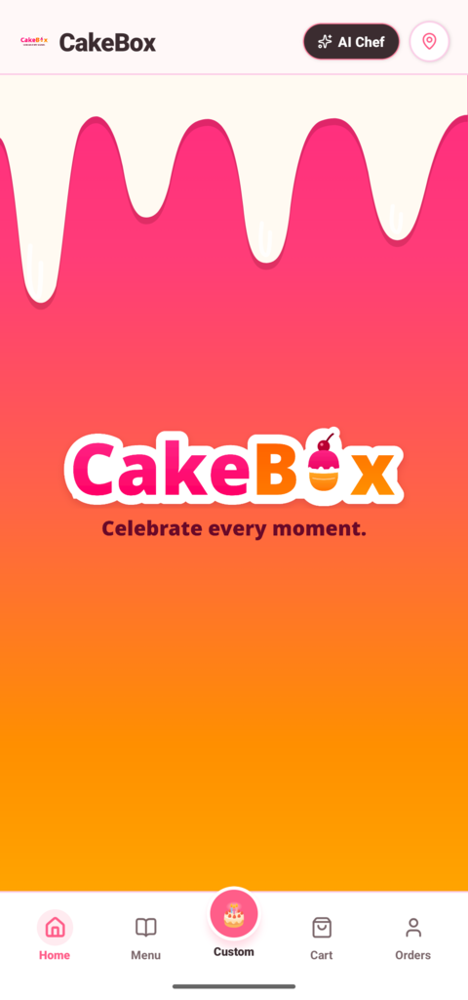
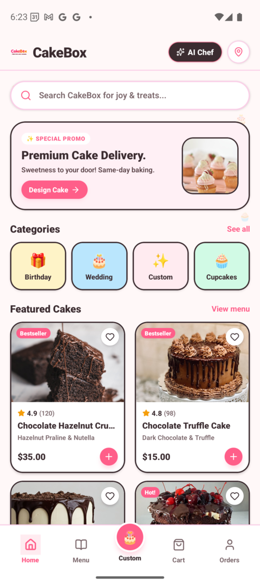
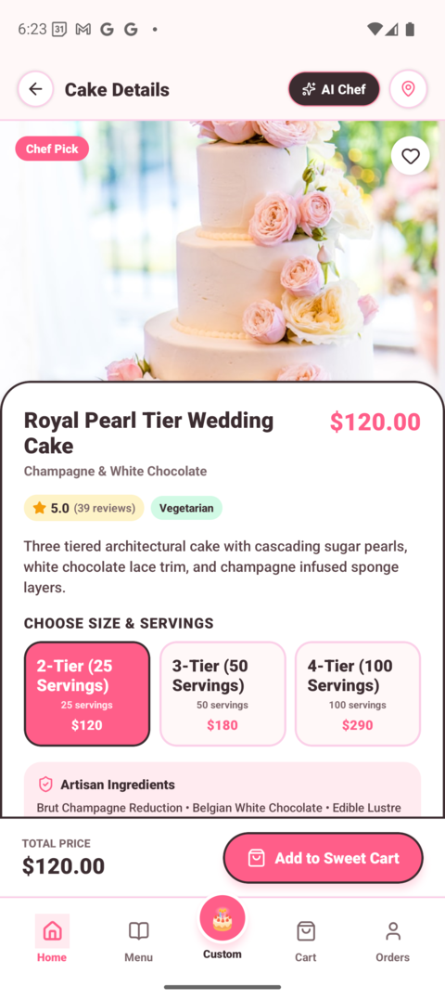
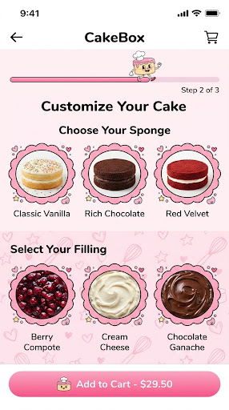
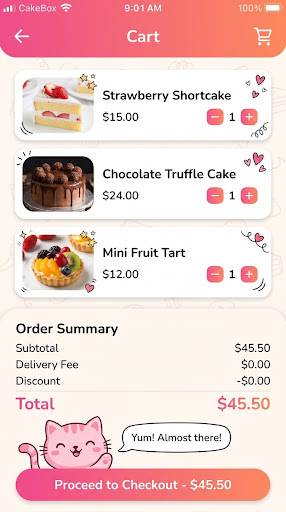
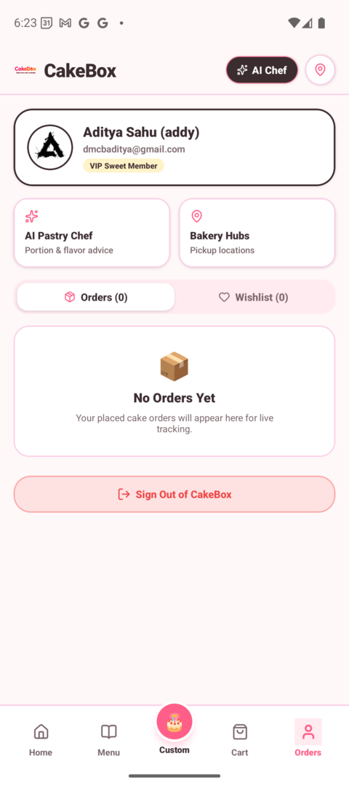

<p align="center">
  
</p>

<p align="center">
  <strong>Celebrate every moment with artisanal cakes & smart custom baking.</strong>
</p>

<p align="center">
  <a href="https://github.com/addynoven/cakebox/releases"></a>
  
  
  
  
  
  
  
  
</p>

---

## 📸 App Showcase

| 🌟 Splash Screen | 🏠 Home & Live Menu | 🎂 Product Details |
| :---: | :---: | :---: |
|  |  |  |

| 🎨 3D Customizer Studio | 🛒 Cart & Promo Engine | 👤 Profile & Orders |
| :---: | :---: | :---: |
|  |  |  |

---

## 🌟 Key Highlights

- 🧭 **Expo Router File-Based Navigation**: Native Stack, dynamic routes (`cake/[id]`), modal presentations, and animated bottom tab bars.
- ⚡ **Dual Caching Layer (TanStack Query + MMKV v4)**: In-memory stale-while-revalidate server caching paired with lightning-fast C++ NitroModules disk persistence.
- 📡 **Automatic Background Offline Sync**: Real-time NetInfo connectivity listener that queues offline orders and syncs them automatically upon reconnect.
- 🛡️ **Defensive Error Resilience**: Root `ErrorBoundary` with recovery UI, typed `Result<T, E>` pattern, and structured error domain logging.
- 🏬 **Repository Pattern & Data Mappers**: Firestore & Supabase SDK calls abstracted behind clean domain mappers (`firestoreMappers.ts`) and repositories.
- 🎨 **3D Interactive Cake Studio**: Real-time layer visualizer for sponge flavors, frosting bowls, drip glazes, toppers, and dynamic tier pricing.
- 👩‍🍳 **Chef Rosette AI Concierge**: Embedded AI pastry consultant powered by **Gemini 2.5 Flash** for flavor pairing, portion estimation, and dietary recommendations.
- 🧪 **Integration-First Testing**: High-speed test harness powered by Bun (`bun test`) validating core domain logic and data transformations in <300ms.

---

## 🛠️ Architecture & Tech Stack

```
                                  +-----------------------+
                                  |    CakeBox Mobile     |
                                  | React Native 0.81.5   |
                                  |   (Expo Router v6)    |
                                  +-----------+-----------+
                                              |
                     +------------------------+------------------------+
                     |                        |                        |
           +---------v---------+    +---------v---------+    +---------v---------+
           |  State & Caching  |    |   Cloud Backend   |    |    AI Services    |
           | TanStack Query v5 |    |  Firestore & Auth |    | Google Gemini API |
           | Zustand 5 + MMKV  |    |  Realtime Sync    |    |  2.5 Flash Model  |
           +-------------------+    +-------------------+    +-------------------+
```

- **Framework**: [React Native 0.81.5](https://reactnative.dev/) with [Expo 54](https://expo.dev/)
- **Navigation**: [Expo Router v6](https://docs.expo.dev/router/introduction/) (file-based routing)
- **Data Caching & Server State**: [TanStack Query v5](https://tanstack.com/query) with domain query key factories
- **Client Storage**: [`react-native-mmkv` v4](https://github.com/mrousavy/react-native-mmkv) with [`react-native-nitro-modules`](https://github.com/mrousavy/nitro) C++ bindings
- **Client State**: [Zustand 5](https://zustand.docs.pmnd.rs/) with MMKV state storage adapter
- **Validation**: [Zod](https://zod.dev/) runtime schema validation for configs & domain models
- **Backend & Database**: [Firebase v12](https://firebase.google.com/) (Cloud Firestore & Authentication)
- **AI Engine**: `@google/genai` (Gemini 2.5 Flash)
- **Network Resilience**: `@react-native-community/netinfo`
- **Testing**: Bun Test (`bun test`)

---

## 📂 Feature-Driven Project Structure

```
cakebox/
├── src/
│   ├── app/                           # Expo Router File-Based Navigation
│   │   ├── (tabs)/                    # Native Bottom Tabs
│   │   │   ├── _layout.tsx
│   │   │   ├── index.tsx              # Home Screen
│   │   │   ├── menu.tsx               # Menu / Catalog Screen
│   │   │   ├── custom.tsx             # 3D Customizer Screen
│   │   │   ├── cart.tsx               # Shopping Cart Screen
│   │   │   └── orders.tsx             # Orders & Profile Screen
│   │   ├── cake/
│   │   │   └── [id].tsx               # Dynamic Product Detail Route
│   │   ├── auth/
│   │   │   └── login.tsx              # Auth Modal Route
│   │   ├── _layout.tsx                # Root Provider, ErrorBoundary & Stack
│   │   └── index.tsx                  # Root Redirect
│   ├── core/                          # Shared System Foundations
│   │   ├── api/                       # Firebase instance, Mappers & HttpClient
│   │   ├── components/                # Tokenized UI primitives (Button, Card, Badge, Input, Toast)
│   │   ├── config/                    # Validated Zod ConfigSchema
│   │   ├── errors/                    # ErrorBoundary, AppError & Result<T, E>
│   │   ├── network/                   # useNetworkStatus & auto-sync listener
│   │   ├── query/                     # QueryClient & QueryProvider
│   │   ├── storage/                   # Synchronous MMKV storage wrapper
│   │   └── theme/                     # Colors, Spacing, Typography & Shadows tokens
│   ├── features/                      # Co-located Domain Feature Modules
│   │   ├── catalog/                   # Models, Repositories, Query Hooks & Views
│   │   ├── customizer/                # 3D Cake Visualizer & Customizer Studio
│   │   ├── cart/                      # Cart Models, Orders Repository & Store
│   │   ├── auth/                      # User Profile, Auth Repository & Login
│   │   ├── ai_chef/                   # Gemini 2.5 Flash AI Pastry Service
│   │   └── map/                       # Bakery Hubs Location Modals
│   ├── data/                          # Seed data & fallback cake models
│   ├── types.ts                       # Public domain type re-exports
│   └── store/                         # Unified Zustand store bridges
├── bunfig.toml                        # Bun test configuration
├── test-setup.ts                      # Integration test mock preload
├── app.json                           # Expo configuration
├── package.json
└── tsconfig.json                      # Strict TypeScript configuration
```

---

## 🚀 Getting Started

### Prerequisites
- **Node.js** >= 18 or **Bun** >= 1.1
- **Android Studio** with Android SDK 34/35 & NDK installed

### 1. Install Dependencies
```bash
bun install
```

### 2. Run Test Suite
```bash
bun test
```

### 3. Type Checking
```bash
bun run ts:check
```

### 4. Run Development Server
```bash
bun run start
```

### 5. Build and Install Native Android Dev Build
Because `react-native-mmkv` v4 utilizes **C++ NitroModules**, run using the native dev build:

```bash
# Build and install debug APK with CMake binaries
cd android && ./gradlew assembleDebug

# Install APK onto running emulator
adb install -r app/build/outputs/apk/debug/app-debug.apk

# Start Metro Bundler
npx expo start --dev-client
```

---

## 📦 Building Standalone Release APK

To create an optimized production APK targeting **64-bit ARM (`arm64-v8a`)** with **R8/ProGuard minification** and **Hermes bytecode**:

```bash
cd android
./gradlew assembleRelease --no-daemon
```

- **Output Path**: `android/app/build/outputs/apk/release/app-release.apk`
- **Output Size**: ~**24 MB** *(optimized from 85+ MB universal build)*

---

## 📄 License
MIT License. Crafted with 💖 for cake lovers everywhere.
